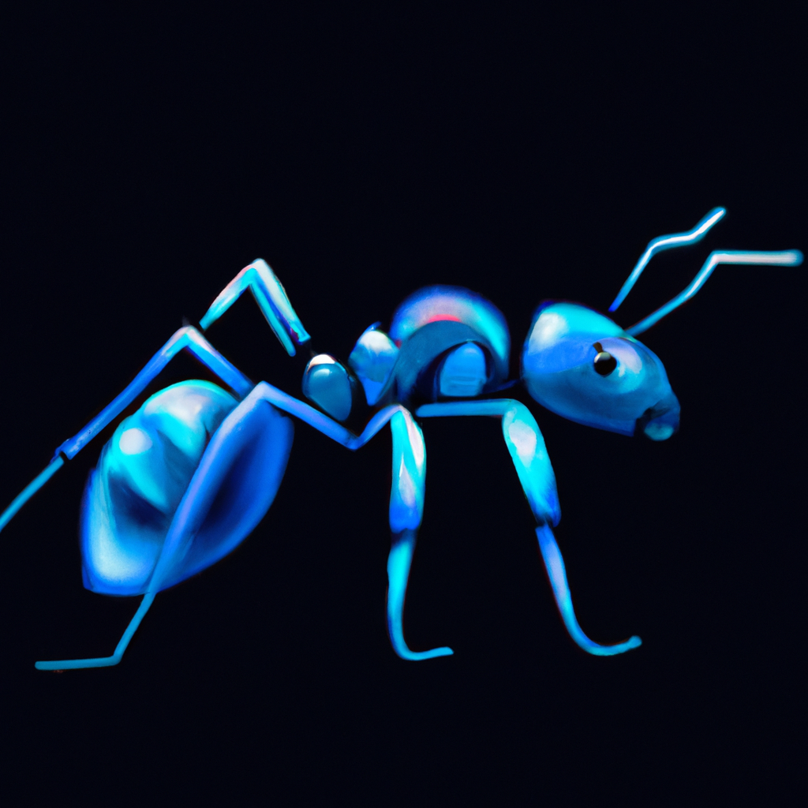

<p align="center">
  <br />
  
  <br/>
  <br />
  <p align="center">


</p>

<br/>

[](#table-of-contents)

<br/>

# Flutter Hub

Flutter Hubでは、私の開発の過程で学んだことをシェアしていこうと思っています！

まずはこのプロジェクトのvscode上での実行の仕方を解説します。

## 始める(Makefile)

Makefileを作成しており、各パッケージのために作成されたプロジェクトを実行するための記述がされています。以下に主なコマンドの解説をしています。

### gen

build_runnerを実行することで、コード生成が必要なものに対して必要なコードを自動生成します。

### run_〇〇

各パッケージのために作られたプロジェクトを実行します。例えば、すべてのパッケージを融合させているmainプロジェクトを実行するには以下のコマンドを実行してください。

```Makefile
make run_main
```

## パッケージ集

以下に各プロジェクトのReadmeのリンクを貼っているので、興味があるパッケージのものを読んでみてください。

|リンク|説明|
|----|-----------|
|[go_router_builder](https://github.com/honganji/flutter_hub/blob/main/lib/go_router_builder/README.md)|ルーティングをサポートするためのパッケージである「go_router」に、パラメータの型安全性やパスの誤りを少なくする機能を追加している。|

## Mainプロジェクト

Mainプロジェクトでは、現在までに学習したパッケージすべてを融合して機能のデモンストレーションを載せています。
